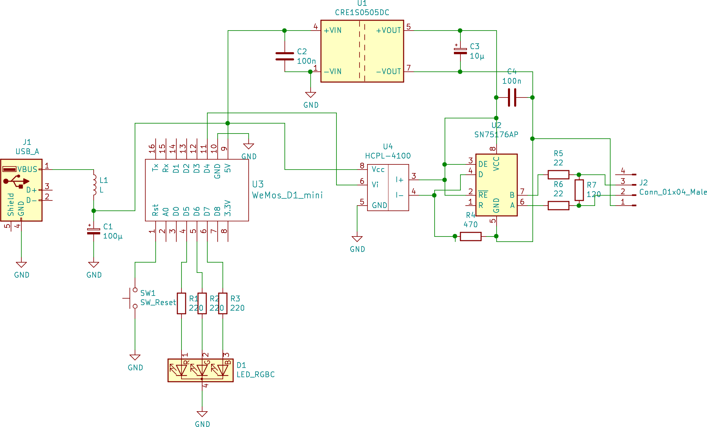
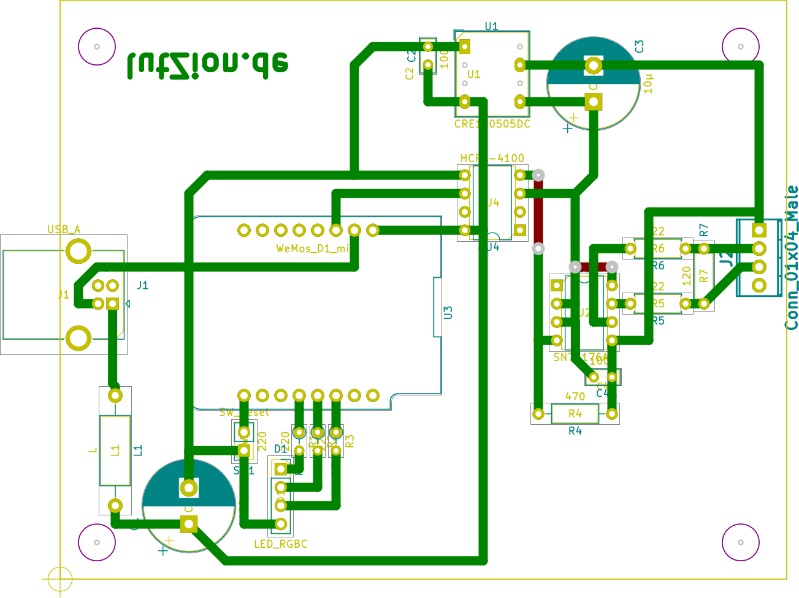
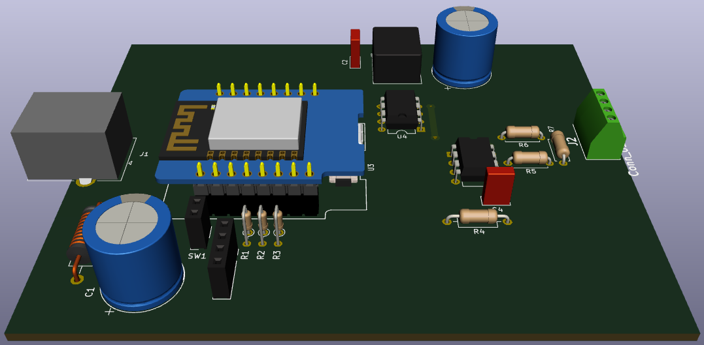
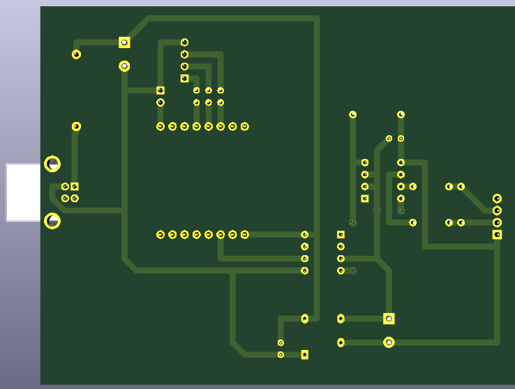
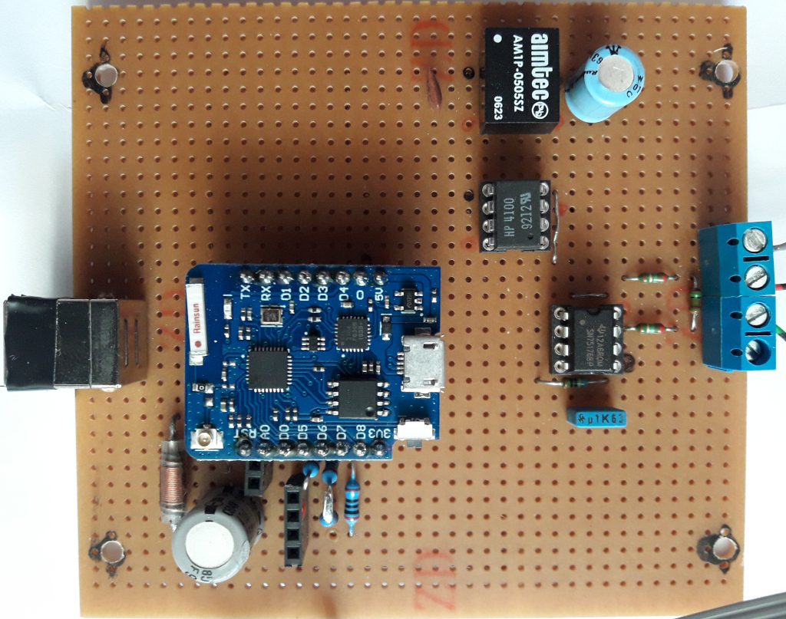
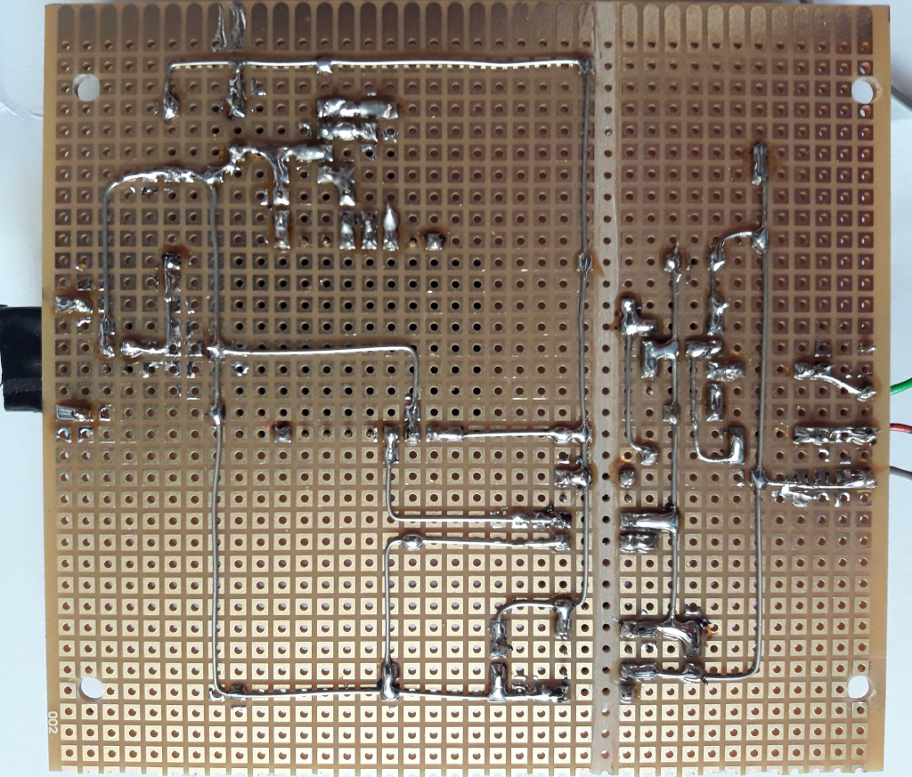
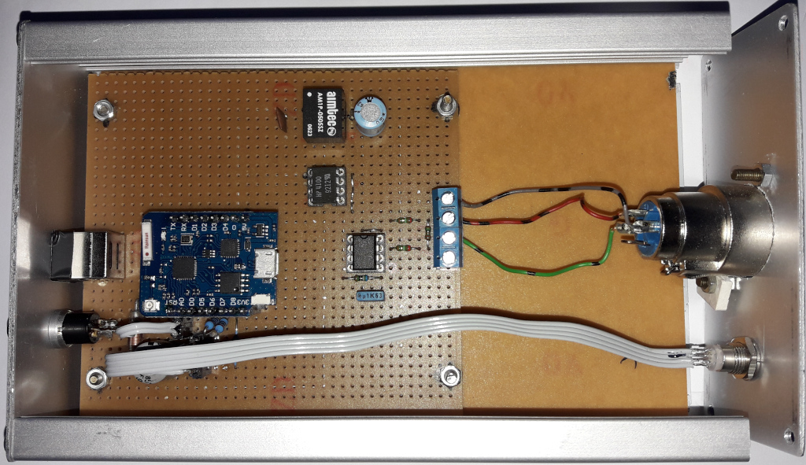

# HARDWARE

Soldering the hardware for the artnet-receiver is derived from my old [uDMX-modification](https://illutzmination.de/udmx-mod.html?&L=1).

More or less the hardware is the same as uDMX, only the ATMega8 is replaced by Wemos D1 mini (pro).

For security reasons the board has a galvanic isolation.

## The theory

  
The sheet

  
The board

  
The board in 3D - top view

  
The board in 3D - bottom view

## The real prototype

  
Top view  
  
  
Bottom view  
  
  
board in box with dmx connector, RGB led and reset button  

  
[Back to main page](README.md)