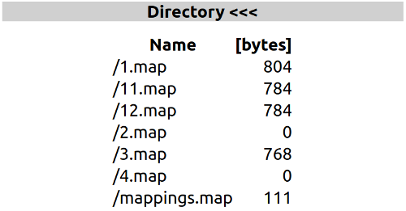

# ESP8266_Artnet_DMX_DC - Artnet to DMX with dimmer curves / mappings 

This project is based on Robert Oostenvelds [esp8266_artnet_dmx512](https://github.com/robertoostenveld/arduino/tree/master/esp8266_artnet_dmx512).
It is not forked, but copied, as `esp8266_artnet_dmx512` is part of the big repository [arduino](https://github.com/robertoostenveld/arduino).

ESP8266_Artnet_DMX_DC is the extended version of esp8266_artnet_dmx512 mainly to implement [dmxmapping](https://github.com/Lutzion/dmxmapping).

## Features
- receive Art-Net data packets and output them to DMX.
- use dmxmapping to change values of the dmx channels in realtime.  
This is called dimmercurve in many dmx softwares.
- receive E1.31 / sACN alternative to Art-Net
- all features working in AP-mode
- firmware update by service menu  
  
## Sequence check
In addition i added checks for artnet sequence, which is important for all sorts of animations.

In UDP communication packets might change their order.  
When sequence is not checked, movements can make unwanted jumps.  
  

If monitor shows too many sequence errors, maybe check your network configurations and dmx software settings.

Calling the web interface might create sequence errors, as the other functions stop for a short time! 

## Settings  Dimmer curves / dmx mapping and more

- universe: universe for Art-Net / sACN. For both cases the first universe is 0.
- channels: number of dmx channels to transfer to serial output. Default is 512.
- delay: delay in milliseconds between dmx transfers. Default is 23 for 512 channels. Thus the refresh rate will be about 40 Hz.
- useMaps: global setting for activating mappings. 0: deactivated, 1 activated
- mapChan: if useMaps is 0 and mapChan is not 0 then the mapChan value is the dmx channel, that is watched to switch mapping on and off according to the value of the dmx channel. If the channels value is smaller 127, mapping is off, otherwise it is on.
- startDelay: time in seconds, that the device will wait for the connection to the router to come up.
- e131Start: if e131Start is 1 the device will also receive sACN data, else it will only receive Art-Net.
- e131Unicast: if e131Unicast is 0, sACN will receive multicast, if 1 it will receive unicast data.
- ap-psk: if ap-psk is not empty, this is the psk for ap-mode. If it is empty, the psk is the reverse part of the mac-adress in ssid.  
  
## The service menu
### Show map files
With the menu `Show map files` in the service menu you can have a look at the existing map files.  
  

### Upload map files
The menu `Upload map files` allows it to select a map file and upload it.

## LED colors
A RGB-LED shows the different states of the esp device:
- RED: not connected to WLAN, error reading configuration, short before reboot
- YELLOW: success reading configuration
- BLUE; web server called
- MAGENTA: no artnet data for more than a second
- GREEN: everything ok

# ATTENTION
**When calling the web interface, dmx output might stop for some seconds.  
Thus do not call the web interface while using the esp-dmx-device for a live show!**

# First start
On the first start you have to connect to the open WLAN access point **ARTNET_DC_&lt;PartOfMac&gt;**. The PSK for that net is the reverse &lt;PartOfMac&gt;. Now 
- enter or select your SSID and 
- enter the password / your PSK.

After rebooting, it will connect to your WLAN.

# Changing WLAN settings
For security reasons starting the wifi-manager to change network settings is only possible after pressing the reset-button 2 times. The wifi-manager will appear, if the device gets no connection.
To force the wifi-manager to come up even if the device is connected, press the reset-button at least 5 times. Using PersWifiManager there is no forcing. PersWifiManager is called by the menu.
  

# Building the hardware
See the [details](HARDWARE.md)  
  
  
# Compiling the software
See the [details](COMPILE.md)  
  
# using dmxmapping  
  
Click the picture to watch the video.
  
  
# DISCLAIMER

**THE SOFTWARE IS PROVIDED "AS IS", WITHOUT WARRANTY OF ANY KIND, EXPRESS OR IMPLIED, INCLUDING BUT NOT LIMITED TO THE WARRANTIES OF MERCHANTABILITY, FITNESS FOR A PARTICULAR PURPOSE AND NONINFRINGEMENT. IN NO EVENT SHALL THE AUTHORS OR COPYRIGHT HOLDERS BE LIABLE FOR ANY CLAIM, DAMAGES OR OTHER LIABILITY, WHETHER IN AN ACTION OF CONTRACT, TORT OR OTHERWISE, ARISING FROM, OUT OF OR IN CONNECTION WITH THE SOFTWARE OR THE USE OR OTHER DEALINGS IN THE SOFTWARE.**

